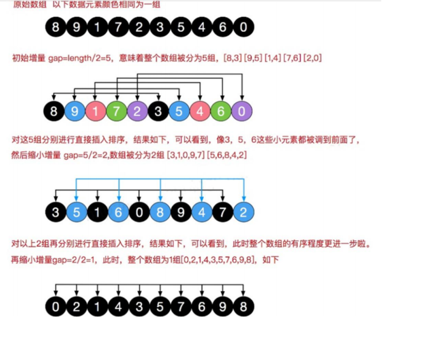
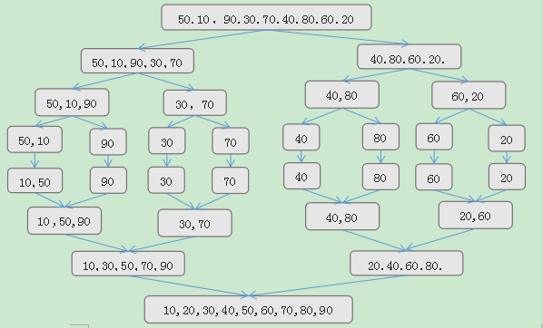
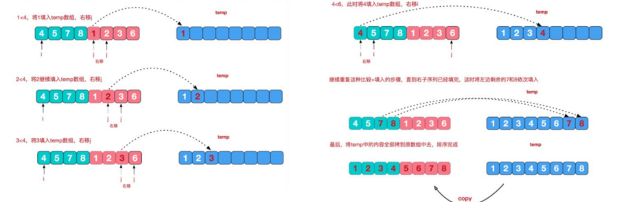
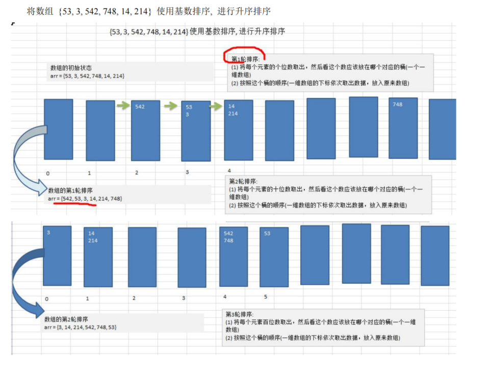
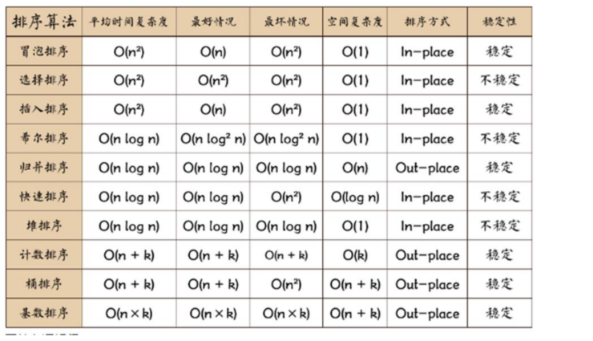

### 排序

#### 冒泡排序

```js
import java.text.SimpleDateFormat;
import java.util.Arrays;
import java.util.Date;

public class BubbleSort {

	public static void main(String[] args) {

		//测试一下冒泡排序的速度O(n^2), 给80000个数据，测试
		//创建要给80000个的随机的数组
		int[] arr = new int[80000];
		for(int i =0; i < 80000;i++) {
			arr[i] = (int)(Math.random() * 8000000); //生成一个[0, 8000000) 数
		}
		
		Date data1 = new Date();
		SimpleDateFormat simpleDateFormat = new SimpleDateFormat("yyyy-MM-dd HH:mm:ss");
		String date1Str = simpleDateFormat.format(data1);
		System.out.println("排序前的时间是=" + date1Str);
		
		//测试冒泡排序
		bubbleSort(arr);
		
		Date data2 = new Date();
		String date2Str = simpleDateFormat.format(data2);
		System.out.println("排序后的时间是=" + date2Str);

		//System.out.println("排序后");
		//System.out.println(Arrays.toString(arr));
	}
	
	// 将前面额冒泡排序算法，封装成一个方法
	public static void bubbleSort(int[] arr) {
		// 冒泡排序 的时间复杂度 O(n^2), 自己写出
		int temp = 0; // 临时变量
		boolean flag = false; // 标识变量，表示是否进行过交换
		for (int i = 0; i < arr.length - 1; i++) {

			for (int j = 0; j < arr.length - 1 - i; j++) {
				// 如果前面的数比后面的数大，则交换
				if (arr[j] > arr[j + 1]) {
					flag = true;
					temp = arr[j];
					arr[j] = arr[j + 1];
					arr[j + 1] = temp;
				}
			}
            
			if (!flag) { // 在一趟排序中，一次交换都没有发生过
				break;
			} else {
				flag = false; // 重置flag!!!, 进行下次判断
			}
		}
	}
}
```

#### 选择排序

##### 1、排序思想

选择排序（select sorting）也是一种简单的排序方法。它的基本思想是∶第一次从arr【0】~arr【n-1】中选取最小值，与arr【0】交换，第二次从 arr【1】~arr【n-1】中选取最小值，与 arr【1】交换，第三次从 arr【2】~arr【n-1】中选取最小值，与 arr【2】交换，…，第i次从 arr【i-1】~arr【n-1】中选取最小值，与arr【i-1】交换，…，第 n-1 次从 arr【n-2】~arr【n-1】中选取最小值，与 arr【n-2】交换，总共通过 n-1 次，得到一个按排序码从小到大排列的有序序列。

```js
package com.atguigu.sort;

import java.text.SimpleDateFormat;
import java.util.Arrays;
import java.util.Date;

//选择排序
public class SelectSort {

    public static void main(String[] args) {

        //创建要给80000个的随机的数组
        int[] arr = new int[80000];
        for (int i = 0; i < 80000; i++) {
            arr[i] = (int) (Math.random() * 8000000); // 生成一个[0, 8000000) 数
        }

        Date data1 = new Date();
        SimpleDateFormat simpleDateFormat = new SimpleDateFormat("yyyy-MM-dd HH:mm:ss");
        String date1Str = simpleDateFormat.format(data1);
        System.out.println("排序前的时间是=" + date1Str);

        selectSort(arr);


        Date data2 = new Date();
        String date2Str = simpleDateFormat.format(data2);
        System.out.println("排序前的时间是=" + date2Str);
    }

    //选择排序
    public static void selectSort(int[] arr) {

        //选择排序时间复杂度是 O(n^2)
        for (int i = 0; i < arr.length - 1; i++) {
            int minIndex = i;
            int min = arr[i];
            for (int j = i + 1; j < arr.length; j++) {
                if (min > arr[j]) { // 说明假定的最小值，并不是最小
                    min = arr[j]; // 重置min
                    minIndex = j; // 重置minIndex
                }
            }

            // 将最小值，放在arr[0], 即交换
            if (minIndex != i) {
                arr[minIndex] = arr[i];
                arr[i] = min;
            }
        }
        
    }
}
```

#### 插入排序

##### 1、排序思想

插入排序 （Insertion Sorting）的基本思想是;把n个待排序的元素看成为一个有序表和一个无序表，开始时有
序表中只包含一个元素，无序表中包含有n-1个元素，排序过程中每次从无序表中取出第一个元素，把它的排序码依次与有序表元素的排序码进行比较，将它插入到有序表中的适当位置，使之成为新的有序表。

```js
package com.atguigu.sort;

import java.text.SimpleDateFormat;
import java.util.Arrays;
import java.util.Date;

public class InsertSort {

    public static void main(String[] args) {

        // 创建要给80000个的随机的数组
        int[] arr = new int[8];
        for (int i = 0; i < 8; i++) {
            arr[i] = (int) (Math.random() * 8); // 生成一个[0, 8000000) 数
        }

        System.out.println("插入排序前");
        Date data1 = new Date();
        SimpleDateFormat simpleDateFormat = new SimpleDateFormat("yyyy-MM-dd HH:mm:ss");
        String date1Str = simpleDateFormat.format(data1);
        System.out.println("排序前的时间是=" + date1Str);

        insertSort(arr); //调用插入排序算法

        Date data2 = new Date();
        String date2Str = simpleDateFormat.format(data2);
        System.out.println("排序前的时间是=" + date2Str);


    }

    //插入排序
    public static void insertSort(int[] arr) {
        int insertVal = 0;
        int insertIndex = 0;
        //使用for循环来把代码简化
        for (int i = 1; i < arr.length; i++) {
            //定义待插入的数
            insertVal = arr[i];
            insertIndex = i - 1; // 即arr[1]的前面这个数的下标

            // 给insertVal 找到插入的位置
            // 说明
            // 1. insertIndex >= 0 保证在给insertVal 找插入位置，不越界
            // 2. insertVal < arr[insertIndex] 待插入的数，还没有找到插入位置
            // 3. 就需要将 arr[insertIndex] 后移
            while (insertIndex >= 0 && insertVal < arr[insertIndex]) {
                arr[insertIndex + 1] = arr[insertIndex];
                insertIndex--;
            }
            // 当退出while循环时，说明插入的位置找到, insertIndex + 1
            // 举例：理解不了，我们一会 debug
            //这里我们判断是否需要赋值
            if (insertIndex + 1 != i) {
                arr[insertIndex + 1] = insertVal;
            }

        }

    }
}
```

#### 希尔排序

##### 1、排序思想

希尔排序是把记录按下标的一定增量分组，对每组使用直接插入排序算法排序; 随着增量逐渐减少，每组包含的关键词越来越多，当增量减至1时，整个文件恰被分成一组，算法便终止



```js
package com.atguigu.sort;

import java.text.SimpleDateFormat;
import java.util.Arrays;
import java.util.Date;

public class ShellSort {

	public static void main(String[] args) {

		int[] arr = new int[8];
		for (int i = 0; i < 8; i++) {
			arr[i] = (int) (Math.random() * 8); // 生成一个[0, 8000000) 数
		}

		System.out.println("排序前");
		Date data1 = new Date();
		SimpleDateFormat simpleDateFormat = new SimpleDateFormat("yyyy-MM-dd HH:mm:ss");
		String date1Str = simpleDateFormat.format(data1);
		System.out.println("排序前的时间是=" + date1Str);
		
		shellSort(arr); //交换式
//		shellSort2(arr);//移位方式
		
		Date data2 = new Date();
		String date2Str = simpleDateFormat.format(data2);
		System.out.println("排序前的时间是=" + date2Str);
	}

	// 使用逐步推导的方式来编写希尔排序
	// 希尔排序时， 对有序序列在插入时采用交换法, 
	// 思路(算法) ===> 代码
	public static void shellSort(int[] arr) {
		
		int temp = 0;
		int count = 0;
		// 根据前面的逐步分析，使用循环处理
		for (int gap = arr.length / 2; gap > 0; gap /= 2) {
			for (int i = gap; i < arr.length; i++) {
				// 遍历各组中所有的元素(共gap组，每组有个元素), 步长gap
				for (int j = i - gap; j >= 0; j -= gap) {
					// 如果当前元素大于加上步长后的那个元素，说明交换
					if (arr[j] > arr[j + gap]) {
						temp = arr[j];
						arr[j] = arr[j + gap];
						arr[j + gap] = temp;
					}
				}
			}
			//System.out.println("希尔排序第" + (++count) + "轮 =" + Arrays.toString(arr));
		}
	}
	
	//对交换式的希尔排序进行优化->移位法
	public static void shellSort2(int[] arr) {
		
		// 增量gap, 并逐步的缩小增量
		for (int gap = arr.length / 2; gap > 0; gap /= 2) {
			// 从第gap个元素，逐个对其所在的组进行直接插入排序
			for (int i = gap; i < arr.length; i++) {
				int j = i;
				int temp = arr[j];
				if (arr[j] < arr[j - gap]) {
					while (j - gap >= 0 && temp < arr[j - gap]) {
						//移动
						arr[j] = arr[j-gap];
						j -= gap;
					}
					//当退出while后，就给temp找到插入的位置
					arr[j] = temp;
				}

			}
		}
	}
}
```

#### 快速排序

##### 1、排序思想

通过一趟排序将要排序的数据分割成独立的两部分，其中一部分的所有数据都比另外一部分的所有数据都要小，然后再按此方法对这两部分数据分别进行快速排序，整个排序过程可以递归进行，以此达到整个数据变成有序

```js
package com.atguigu.sort;

public class quick {
    public static void main(String[] args) {
        int arr[] = new int[]{3,3,3,7,9,122344,4656,34,34,4656,5,6,7,8,9,343,57765,23,12321};
        int len = arr.length-1;
        arr=qsort(arr,0,len);
        for (int i:arr) {
            System.out.print(i+"\t");
        }
    }
    public static int[] qsort(int arr[],int start,int end) {
        int pivot = arr[start];
        int i = start;
        int j = end;
        while (i<j) {
            while ((i<j)&&(arr[j]>pivot)) {
                j--;
            }
            while ((i<j)&&(arr[i]<pivot)) {
                i++;
            }
            if ((arr[i]==arr[j])&&(i<j)) {
                i++;
            } else {
                int temp = arr[i];
                arr[i] = arr[j];
                arr[j] = temp;
            }
        }
        if (i-1>start) arr=qsort(arr,start,i-1);
        if (j+1<end) arr=qsort(arr,j+1,end);
        return (arr);
    }

}
```

#### 归并排序

1、排序思想

其基本原理如下：对于给定的一组记录，利用递归与分治技术将数据序列划分成为越来越小的半子表，在对半子表排序，最后再用递归方法将排好序的半子表合并成为越来越大的有序序列。





```js
package com.atguigu.sort;

import java.text.SimpleDateFormat;
import java.util.Arrays;
import java.util.Date;

public class MergetSort {

	public static void main(String[] args) {
		//int arr[] = { 8, 4, 5, 7, 1, 3, 6, 2 }; //
		
		//测试快排的执行速度
		// 创建要给80000个的随机的数组
		int[] arr = new int[8];
		for (int i = 0; i < 8; i++) {
			arr[i] = (int) (Math.random() * 8);
		}
		System.out.println("排序前");
		Date data1 = new Date();
		SimpleDateFormat simpleDateFormat = new SimpleDateFormat("yyyy-MM-dd HH:mm:ss");
		String date1Str = simpleDateFormat.format(data1);
		System.out.println("排序前的时间是=" + date1Str);
		
		int temp[] = new int[arr.length]; //归并排序需要一个额外空间
 		mergeSort(arr, 0, arr.length - 1, temp);
 		
 		Date data2 = new Date();
		String date2Str = simpleDateFormat.format(data2);
		System.out.println("排序前的时间是=" + date2Str);
 		
 		//System.out.println("归并排序后=" + Arrays.toString(arr));
	}
	
	
	//分+合方法
	public static void mergeSort(int[] arr, int left, int right, int[] temp) {
		if(left < right) {
			int mid = (left + right) / 2; //中间索引
			//向左递归进行分解
			mergeSort(arr, left, mid, temp);
			//向右递归进行分解
			mergeSort(arr, mid + 1, right, temp);
			//合并
			merge(arr, left, mid, right, temp);
			
		}
	}
	
	//合并的方法
	/**
	 * 
	 * @param arr 排序的原始数组
	 * @param left 左边有序序列的初始索引
	 * @param mid 中间索引
	 * @param right 右边索引
	 * @param temp 做中转的数组
	 */
	public static void merge(int[] arr, int left, int mid, int right, int[] temp) {
		
		int i = left; // 初始化i, 左边有序序列的初始索引
		int j = mid + 1; //初始化j, 右边有序序列的初始索引
		int t = 0; // 指向temp数组的当前索引
		
		//(一)
		//先把左右两边(有序)的数据按照规则填充到temp数组
		//直到左右两边的有序序列，有一边处理完毕为止
		while (i <= mid && j <= right) {//继续
			//如果左边的有序序列的当前元素，小于等于右边有序序列的当前元素
			//即将左边的当前元素，填充到 temp数组 
			//然后 t++, i++
			if(arr[i] <= arr[j]) {
				temp[t] = arr[i];
				t += 1;
				i += 1;
			} else { //反之,将右边有序序列的当前元素，填充到temp数组
				temp[t] = arr[j];
				t += 1;
				j += 1;
			}
		}
		
		//(二)
		//把有剩余数据的一边的数据依次全部填充到temp
		while( i <= mid) { //左边的有序序列还有剩余的元素，就全部填充到temp
			temp[t] = arr[i];
			t += 1;
			i += 1;	
		}
		
		while( j <= right) { //右边的有序序列还有剩余的元素，就全部填充到temp
			temp[t] = arr[j];
			t += 1;
			j += 1;	
		}
		
		
		//(三)
		//将temp数组的元素拷贝到arr
		//注意，并不是每次都拷贝所有
		t = 0;
		int tempLeft = left; // 
		//第一次合并 tempLeft = 0 , right = 1 //  tempLeft = 2  right = 3 // tL=0 ri=3
		//最后一次 tempLeft = 0  right = 7
		while(tempLeft <= right) { 
			arr[tempLeft] = temp[t];
			t += 1;
			tempLeft += 1;
		}
		
	}
}
```

#### 基数排序

##### 1、排序思想

将所有待比较数值统一为同样的数位长度，数位较短的数前面补零。然后，从最低位开始，依次进行一次排序。这样从最低位排序一直到最高位排序完成以后，数列就变成一个有序序列。



```js
package com.atguigu.sort;

import java.text.SimpleDateFormat;
import java.util.Arrays;
import java.util.Date;

public class RadixSort {

	public static void main(String[] args) {
		int arr[] = { 53, 3, 542, 748, 14, 214};
		radixSort(arr);
		System.out.println("基数排序后 " + Arrays.toString(arr));
		
	}

	//基数排序方法
	public static void radixSort(int[] arr) {
		
		//1. 得到数组中最大的数的位数
		int max = arr[0]; //假设第一数就是最大数
		for(int i = 1; i < arr.length; i++) {
			if (arr[i] > max) {
				max = arr[i];
			}
		}
		//得到最大数是几位数
		int maxLength = (max + "").length();
		
		
		//定义一个二维数组，表示10个桶, 每个桶就是一个一维数组
		//说明
		//1. 二维数组包含10个一维数组
		//2. 为了防止在放入数的时候，数据溢出，则每个一维数组(桶)，大小定为arr.length
		//3. 基数排序是使用空间换时间的经典算法
		int[][] bucket = new int[10][arr.length];
		
		//为了记录每个桶中，实际存放了多少个数据,我们定义一个一维数组来记录各个桶的每次放入的数据个数
		//比如：bucketElementCounts[0] , 记录的就是  bucket[0] 桶的放入数据个数
		int[] bucketElementCounts = new int[10];

		
		for(int i = 0 , n = 1; i < maxLength; i++, n *= 10) {
			//(针对每个元素的对应位进行排序处理)， 第一次是个位，第二次是十位，第三次是百位..
			for(int j = 0; j < arr.length; j++) {
				//取出每个元素的对应位的值
				int digitOfElement = arr[j] / n % 10;
				//放入到对应的桶中
				bucket[digitOfElement][bucketElementCounts[digitOfElement]] = arr[j];
				bucketElementCounts[digitOfElement]++;
			}
			//按照这个桶的顺序(一维数组的下标依次取出数据，放入原来数组)
			int index = 0;
			//遍历每一桶，并将桶中是数据，放入到原数组
			for(int k = 0; k < bucketElementCounts.length; k++) {
				//如果桶中，有数据，我们才放入到原数组
				if(bucketElementCounts[k] != 0) {
					//循环该桶即第k个桶(即第k个一维数组), 放入
					for(int l = 0; l < bucketElementCounts[k]; l++) {
						//取出元素放入到arr
						arr[index++] = bucket[k][l];
					}
				}
				//第i+1轮处理后，需要将每个 bucketElementCounts[k] = 0 ！！！！
				bucketElementCounts[k] = 0;
				
			}
			//System.out.println("第"+(i+1)+"轮，对个位的排序处理 arr =" + Arrays.toString(arr));
			
		}

	}
}
```

### 排序算法总结



