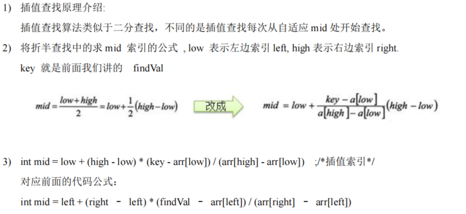
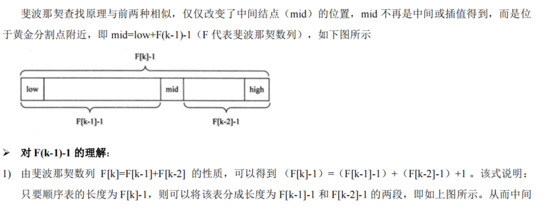
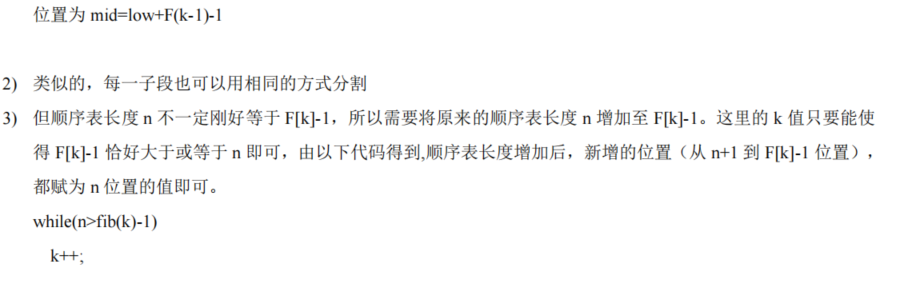

### 查找

#### 线性查找算法

```js
package com.atguigu.search;

public class SeqSearch {

	public static void main(String[] args) {
		int arr[] = { 1, 9, 11, -1, 34, 89 };// 没有顺序的数组
		int index = seqSearch(arr, -11);
		if(index == -1) {
			System.out.println("没有找到到");
		} else {
			System.out.println("找到，下标为=" + index);
		}
	}

	/**
	 * 这里我们实现的线性查找是找到一个满足条件的值，就返回
	 * @param arr
	 * @param value
	 * @return
	 */
	public static int seqSearch(int[] arr, int value) {
		// 线性查找是逐一比对，发现有相同值，就返回下标
		for (int i = 0; i < arr.length; i++) {
			if(arr[i] == value) {
				return i;
			}
		}
		return -1;
	}

}
```

#### 二分查找算法

##### 1、二分查找算法的思想

```
生找的思路分析
1.首先确定该数组的中间的下标 mid= (left+right)/2
2. 然后让需要查找的数findval和arr【mid】 比较
	2.1 findval>arr【mid】，说明你要查找的数在mid的右边，因此需要递归的向右查找 
	2.2 findval<arr【mid】，说明你要查找的数在mid 的左边，因此需要递归的向左查找 
	2.3 findVal==arr【mid】 说明找到，就返回
什么时候我们需要结束递归. 
1） 找到就结束递归"需要退出
2） 递归完整个数组，仍然没有找到findval，也需要结束递归
```

```js
package com.atguigu.search;

import java.util.ArrayList;
import java.util.List;

//注意：使用二分查找的前提是 该数组是有序的.
public class BinarySearch {

	public static void main(String[] args) {
		int arr[] = { 1, 2, 3, 4, 5, 6, 7, 8, 9, 10 , 11, 12, 13,14,15,16,17,18,19,20 };
		


		int resIndex = binarySearch(arr, 0, arr.length - 1, 5);
		System.out.println("resIndex=" + resIndex);
		
		List<Integer> resIndexList = binarySearch2(arr, 0, arr.length - 1, 1);
		System.out.println("resIndexList=" + resIndexList);
	}

	// 二分查找算法

	public static int binarySearch(int[] arr, int left, int right, int findVal) {
		

		// 当 left > right 时，说明递归整个数组，但是没有找到
		if (left > right) {
			return -1;
		}
		int mid = (left + right) / 2;
		int midVal = arr[mid];

		if (findVal > midVal) { // 向 右递归
			return binarySearch(arr, mid + 1, right, findVal);
		} else if (findVal < midVal) { // 向左递归
			return binarySearch(arr, left, mid - 1, findVal);
		} else {
			return mid;
		}

	}
	
	//完成一个课后思考题:
	/*
	 * 课后思考题： {1,8, 10, 89, 1000, 1000，1234} 当一个有序数组中，
	 * 有多个相同的数值时，如何将所有的数值都查找到，比如这里的 1000
	 * 
	 * 思路分析
	 * 1. 在找到mid 索引值，不要马上返回
	 * 2. 向mid 索引值的左边扫描，将所有满足 1000， 的元素的下标，加入到集合ArrayList
	 * 3. 向mid 索引值的右边扫描，将所有满足 1000， 的元素的下标，加入到集合ArrayList
	 * 4. 将Arraylist返回
	 */

	public static List<Integer> binarySearch2(int[] arr, int left, int right, int findVal) {

		// 当 left > right 时，说明递归整个数组，但是没有找到
		if (left > right) {
			return new ArrayList<Integer>();
		}
		int mid = (left + right) / 2;
		int midVal = arr[mid];

		if (findVal > midVal) { // 向 右递归
			return binarySearch2(arr, mid + 1, right, findVal);
		} else if (findVal < midVal) { // 向左递归
			return binarySearch2(arr, left, mid - 1, findVal);
		} else {
            /*
			 * 思路分析
			 * 1. 在找到mid 索引值，不要马上返回
			 * 2. 向mid 索引值的左边扫描，将所有满足 1000， 的元素的下标，加入到集合ArrayList
			 * 3. 向mid 索引值的右边扫描，将所有满足 1000， 的元素的下标，加入到集合ArrayList
			 * 4. 将Arraylist返回
			*/
			
			List<Integer> resIndexlist = new ArrayList<Integer>();
			//向mid 索引值的左边扫描，将所有满足 1000， 的元素的下标，加入到集合ArrayList
			int temp = mid - 1;
			while(true) {
				if (temp < 0 || arr[temp] != findVal) {//退出
					break;
				}
				//否则，就temp 放入到 resIndexlist
				resIndexlist.add(temp);
				temp -= 1; //temp左移
			}
			resIndexlist.add(mid);  //
			
			//向mid 索引值的右边扫描，将所有满足 1000， 的元素的下标，加入到集合ArrayList
			temp = mid + 1;
			while(true) {
				if (temp > arr.length - 1 || arr[temp] != findVal) {//退出
					break;
				}
				//否则，就temp 放入到 resIndexlist
				resIndexlist.add(temp);
				temp += 1; //temp右移
			}
			
			return resIndexlist;
		}

	}
}
```

#### 插值查找

对于数据量较大，关键字分布比较均匀的查找表来说，采用插值查找。速度较快
关键字分布不均匀的情况下，该方法不一定比折半查找要好



```js
package com.atguigu.search;

import java.util.Arrays;

public class InsertValueSearch {

	public static void main(String[] args) {

		int arr[] = { 1, 8, 10, 89,1000,1000, 1234 };
		
		int index = insertValueSearch(arr, 0, arr.length - 1, 1234);
		System.out.println("index = " + index);
	}

	//编写插值查找算法
	//说明：插值查找算法，也要求数组是有序的
	public static int insertValueSearch(int[] arr, int left, int right, int findVal) { 

		System.out.println("插值查找次数~~");
		
		//注意：findVal < arr[0]  和  findVal > arr[arr.length - 1] 必须需要
		//否则我们得到的 mid 可能越界
		if (left > right || findVal < arr[0] || findVal > arr[arr.length - 1]) {
			return -1;
		}

		// 求出mid, 自适应
		int mid = left + (right - left) * (findVal - arr[left]) / (arr[right] - arr[left]);
		int midVal = arr[mid];
		if (findVal > midVal) { // 说明应该向右边递归
			return insertValueSearch(arr, mid + 1, right, findVal);
		} else if (findVal < midVal) { // 说明向左递归查找
			return insertValueSearch(arr, left, mid - 1, findVal);
		} else {
			return mid;
		}

	}
}
```

#### 斐波那锲查找算法





```js
package com.atguigu.search;

import java.util.Arrays;

public class FibonacciSearch {

	public static int maxSize = 20;
	public static void main(String[] args) {
		int [] arr = {1,8, 10, 89, 1000, 1234};
		
		System.out.println("index=" + fibSearch(arr, 189));// 0
		
	}

	//因为后面我们mid=low+F(k-1)-1，需要使用到斐波那契数列，因此我们需要先获取到一个斐波那契数列
	//非递归方法得到一个斐波那契数列
	public static int[] fib() {
		int[] f = new int[maxSize];
		f[0] = 1;
		f[1] = 1;
		for (int i = 2; i < maxSize; i++) {
			f[i] = f[i - 1] + f[i - 2];
		}
		return f;
	}
	
	//编写斐波那契查找算法
	//使用非递归的方式编写算法
	public static int fibSearch(int[] a, int key) {
		int low = 0;
		int high = a.length - 1;
		int k = 0; //表示斐波那契分割数值的下标
		int mid = 0; //存放mid值
		int f[] = fib(); //获取到斐波那契数列
		//获取到斐波那契分割数值的下标
		while(high > f[k] - 1) {
			k++;
		}
		//因为 f[k] 值 可能大于 a 的 长度，因此我们需要使用Arrays类，构造一个新的数组，并指向temp[]
		//不足的部分会使用0填充
		int[] temp = Arrays.copyOf(a, f[k]);
		//实际上需求使用a数组最后的数填充 temp
		//举例:
		//temp = {1,8, 10, 89, 1000, 1234, 0, 0}  => {1,8, 10, 89, 1000, 1234, 1234, 1234,}
		for(int i = high + 1; i < temp.length; i++) {
			temp[i] = a[high];
		}
		
		// 使用while来循环处理，找到我们的数 key
		while (low <= high) { // 只要这个条件满足，就可以找
			mid = low + f[k - 1] - 1;
			if(key < temp[mid]) { //我们应该继续向数组的前面查找(左边)
				high = mid - 1;
				//为甚是 k--
				//说明
				//1. 全部元素 = 前面的元素 + 后边元素
				//2. f[k] = f[k-1] + f[k-2]
				//因为 前面有 f[k-1]个元素,所以可以继续拆分 f[k-1] = f[k-2] + f[k-3]
				//即 在 f[k-1] 的前面继续查找 k--
				//即下次循环 mid = f[k-1-1]-1
				k--;
			} else if ( key > temp[mid]) { // 我们应该继续向数组的后面查找(右边)
				low = mid + 1;
				//为什么是k -=2
				//说明
				//1. 全部元素 = 前面的元素 + 后边元素
				//2. f[k] = f[k-1] + f[k-2]
				//3. 因为后面我们有f[k-2] 所以可以继续拆分 f[k-1] = f[k-3] + f[k-4]
				//4. 即在f[k-2] 的前面进行查找 k -=2
				//5. 即下次循环 mid = f[k - 1 - 2] - 1
				k -= 2;
			} else { //找到
				//需要确定，返回的是哪个下标
				if(mid <= high) {
					return mid;
				} else {
					return high;
				}
			}
		}
		return -1;
	}
}
```

