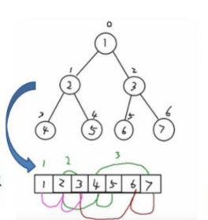
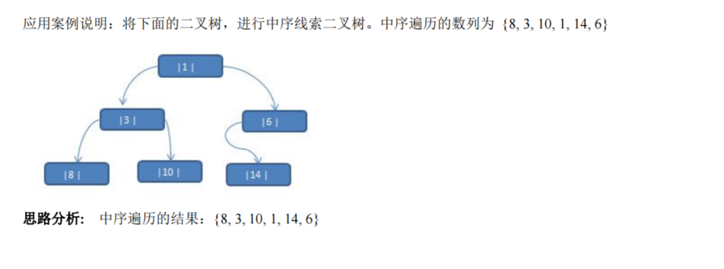
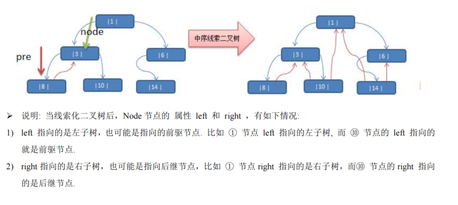
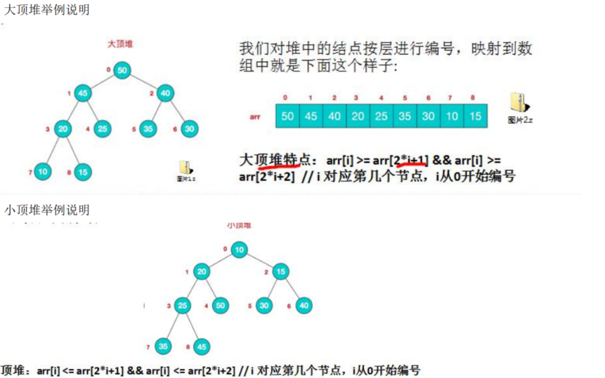
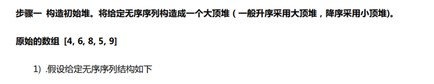
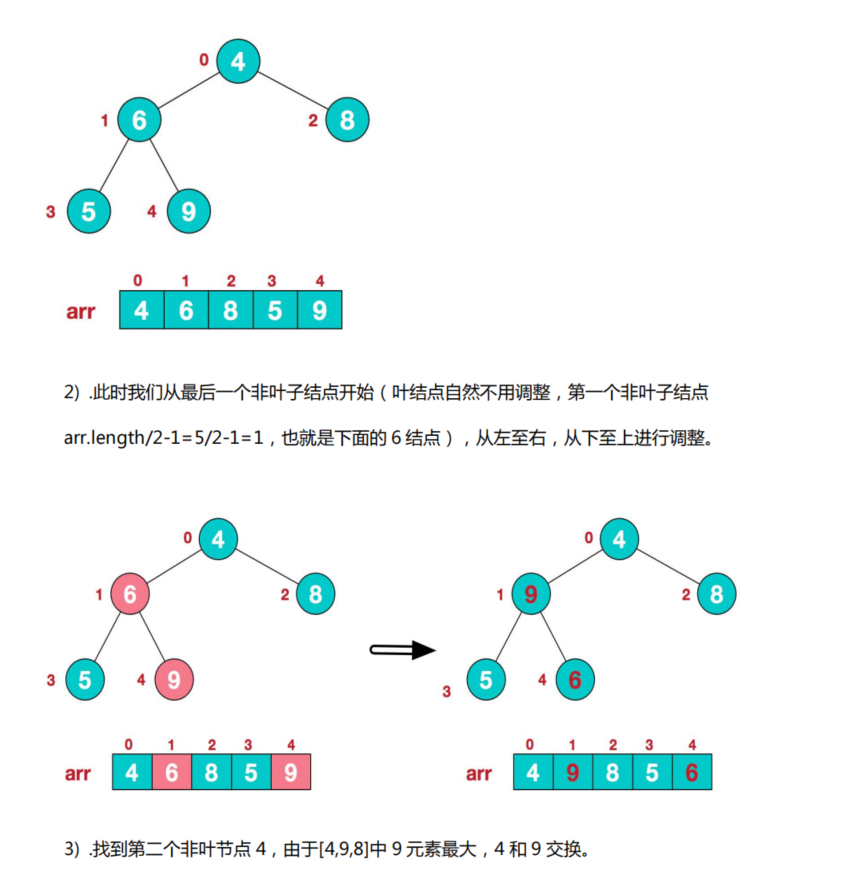
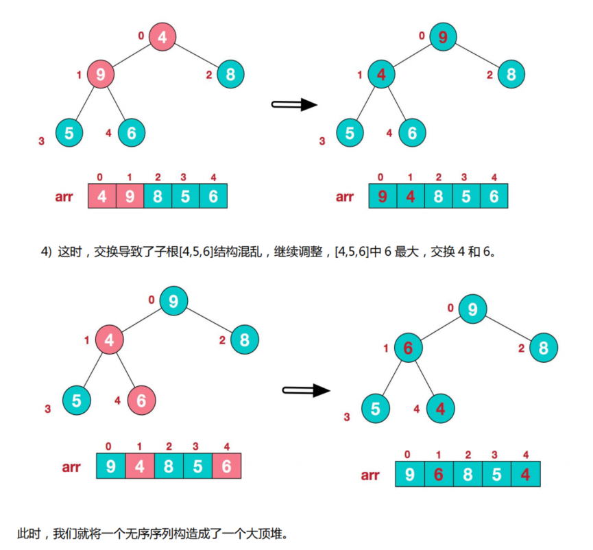
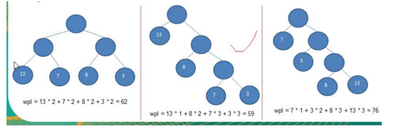

### 树

#### 二叉树遍历应用实例

二叉树的前中后序遍历，和前中后序查找

```js
package com.atguigu.tree;

public class BinaryTreeDemo {

    public static void main(String[] args) {
        //先需要创建一颗二叉树
        BinaryTree binaryTree = new BinaryTree();
        //创建需要的结点
        HeroNode root = new HeroNode(1, "宋江");
        HeroNode node2 = new HeroNode(2, "吴用");
        HeroNode node3 = new HeroNode(3, "卢俊义");
        HeroNode node4 = new HeroNode(4, "林冲");
        HeroNode node5 = new HeroNode(5, "关胜");

        //说明，我们先手动创建该二叉树，后面我们学习递归的方式创建二叉树
        root.setLeft(node2);
        root.setRight(node3);
        node3.setRight(node4);
        node3.setLeft(node5);
        binaryTree.setRoot(root);

        System.out.println("前序遍历"); // 1,2,3,5,4
        binaryTree.preOrder();

        System.out.println("中序遍历");
        binaryTree.infixOrder(); // 2,1,5,3,4

        System.out.println("后序遍历");
        binaryTree.postOrder(); // 2,5,4,3,1

        //前序遍历查找
        HeroNode resNode1 = binaryTree.preOrderSearch(5);
        if (resNode1 != null) {
            System.out.printf("找到了，信息为 no=%d name=%s", resNode1.getNo(), resNode1.getName());
        } else {
            System.out.printf("没有找到 no = %d 的英雄", 5);
        }

        //中序遍历查找
        HeroNode resNode2 = binaryTree.infixOrderSearch(5);
        if (resNode2 != null) {
            System.out.printf("找到了，信息为 no=%d name=%s", resNode2.getNo(), resNode2.getName());
        } else {
            System.out.printf("没有找到 no = %d 的英雄", 5);
        }

        //后序遍历查找
        HeroNode resNode3 = binaryTree.postOrderSearch(5);
        if (resNode3 != null) {
            System.out.printf("找到了，信息为 no=%d name=%s", resNode3.getNo(), resNode3.getName());
        } else {
            System.out.printf("没有找到 no = %d 的英雄", 5);
        }

        //删除结点
		/*
		System.out.println("删除前,前序遍历");
		binaryTree.preOrder(); //  1,2,3,5,4
		binaryTree.delNode(5);
		//binaryTree.delNode(3);
		System.out.println("删除后，前序遍历");
		binaryTree.preOrder(); // 1,2,3,4
		 */


    }

}

//定义BinaryTree 二叉树
class BinaryTree {
    private HeroNode root;

    public void setRoot(HeroNode root) {
        this.root = root;
    }

    //删除结点
    public void delNode(int no) {
        if (root != null) {
            //如果只有一个root结点, 这里立即判断root是不是就是要删除结点
            if (root.getNo() == no) {
                root = null;
            } else {
                //递归删除
                root.delNode(no);
            }
        } else {
            System.out.println("空树，不能删除~");
        }
    }

    //前序遍历
    public void preOrder() {
        if (this.root != null) {
            this.root.preOrder();
        } else {
            System.out.println("二叉树为空，无法遍历");
        }
    }

    //中序遍历
    public void infixOrder() {
        if (this.root != null) {
            this.root.infixOrder();
        } else {
            System.out.println("二叉树为空，无法遍历");
        }
    }

    //后序遍历
    public void postOrder() {
        if (this.root != null) {
            this.root.postOrder();
        } else {
            System.out.println("二叉树为空，无法遍历");
        }
    }

    //遍历查询
    //前序遍历
    public HeroNode preOrderSearch(int no) {
        if (root != null) {
            return root.preOrderSearch(no);
        } else {
            return null;
        }
    }

    //中序遍历
    public HeroNode infixOrderSearch(int no) {
        if (root != null) {
            return root.infixOrderSearch(no);
        } else {
            return null;
        }
    }

    //后序遍历
    public HeroNode postOrderSearch(int no) {
        if (root != null) {
            return this.root.postOrderSearch(no);
        } else {
            return null;
        }
    }
}

//先创建HeroNode 结点
class HeroNode {
    private int no;
    private String name;
    private HeroNode left; //默认null
    private HeroNode right; //默认null

    public HeroNode(int no, String name) {
        this.no = no;
        this.name = name;
    }

    public int getNo() {
        return no;
    }

    public void setNo(int no) {
        this.no = no;
    }

    public String getName() {
        return name;
    }

    public void setName(String name) {
        this.name = name;
    }

    public HeroNode getLeft() {
        return left;
    }

    public void setLeft(HeroNode left) {
        this.left = left;
    }

    public HeroNode getRight() {
        return right;
    }

    public void setRight(HeroNode right) {
        this.right = right;
    }

    @Override
    public String toString() {
        return "HeroNode [no=" + no + ", name=" + name + "]";
    }

    //递归删除结点
    //1.如果删除的节点是叶子节点，则删除该节点
    //2.如果删除的节点是非叶子节点，则删除该子树
    public void delNode(int no) {

        //思路
		/*
		 * 	1. 因为我们的二叉树是单向的，所以我们是判断当前结点的子结点是否需要删除结点，而不能去判断当前这个结点是不是需要删除结点.
			2. 如果当前结点的左子结点不为空，并且左子结点 就是要删除结点，就将this.left = null; 并且就返回(结束递归删除)
			3. 如果当前结点的右子结点不为空，并且右子结点 就是要删除结点，就将this.right= null ;并且就返回(结束递归删除)
			4. 如果第2和第3步没有删除结点，那么我们就需要向左子树进行递归删除
			5.  如果第4步也没有删除结点，则应当向右子树进行递归删除.

		 */
        //2. 如果当前结点的左子结点不为空，并且左子结点 就是要删除结点，就将this.left = null; 并且就返回(结束递归删除)
        if (this.left != null && this.left.no == no) {
            this.left = null;
            return;
        }
        //3.如果当前结点的右子结点不为空，并且右子结点 就是要删除结点，就将this.right= null ;并且就返回(结束递归删除)
        if (this.right != null && this.right.no == no) {
            this.right = null;
            return;
        }
        //4.我们就需要向左子树进行递归删除
        if (this.left != null) {
            this.left.delNode(no);
        }
        //5.则应当向右子树进行递归删除
        if (this.right != null) {
            this.right.delNode(no);
        }
    }

    //编写前序遍历的方法
    public void preOrder() {
        System.out.println(this); //先输出父结点
        //递归向左子树前序遍历
        if (this.left != null) {
            this.left.preOrder();
        }
        //递归向右子树前序遍历
        if (this.right != null) {
            this.right.preOrder();
        }
    }

    //中序遍历
    public void infixOrder() {

        //递归向左子树中序遍历
        if (this.left != null) {
            this.left.infixOrder();
        }
        //输出父结点
        System.out.println(this);
        //递归向右子树中序遍历
        if (this.right != null) {
            this.right.infixOrder();
        }
    }

    //后序遍历
    public void postOrder() {
        if (this.left != null) {
            this.left.postOrder();
        }
        if (this.right != null) {
            this.right.postOrder();
        }
        System.out.println(this);
    }

    //前序遍历查找

    /**
     * @param no 查找no
     * @return 如果找到就返回该Node ,如果没有找到返回 null
     */
    public HeroNode preOrderSearch(int no) {
        System.out.println("进入前序遍历");
        //比较当前结点是不是
        if (this.no == no) {
            return this;
        }
        //1.则判断当前结点的左子节点是否为空，如果不为空，则递归前序查找
        //2.如果左递归前序查找，找到结点，则返回
        HeroNode resNode = null;
        if (this.left != null) {
            resNode = this.left.preOrderSearch(no);
        }
        if (resNode != null) {//说明我们左子树找到
            return resNode;
        }
        //1.左递归前序查找，找到结点，则返回，否继续判断，
        //2.当前的结点的右子节点是否为空，如果不空，则继续向右递归前序查找
        if (this.right != null) {
            resNode = this.right.preOrderSearch(no);
        }
        return resNode;
    }

    //中序遍历查找
    public HeroNode infixOrderSearch(int no) {
        //判断当前结点的左子节点是否为空，如果不为空，则递归中序查找
        HeroNode resNode = null;
        if (this.left != null) {
            resNode = this.left.infixOrderSearch(no);
        }
        if (resNode != null) {
            return resNode;
        }
        System.out.println("进入中序查找");
        //如果找到，则返回，如果没有找到，就和当前结点比较，如果是则返回当前结点
        if (this.no == no) {
            return this;
        }
        //否则继续进行右递归的中序查找
        if (this.right != null) {
            resNode = this.right.infixOrderSearch(no);
        }
        return resNode;

    }

    //后序遍历查找
    public HeroNode postOrderSearch(int no) {

        //判断当前结点的左子节点是否为空，如果不为空，则递归后序查找
        HeroNode resNode = null;
        if (this.left != null) {
            resNode = this.left.postOrderSearch(no);
        }
        if (resNode != null) {//说明在左子树找到
            return resNode;
        }

        //如果左子树没有找到，则向右子树递归进行后序遍历查找
        if (this.right != null) {
            resNode = this.right.postOrderSearch(no);
        }
        if (resNode != null) {
            return resNode;
        }
        System.out.println("进入后序查找");
        //如果左右子树都没有找到，就比较当前结点是不是
        if (this.no == no) {
            return this;
        }
        return resNode;
    }

}
```

#### 顺序存储二叉树

##### 概念

从数据存储来看，数组存储方式和树的存储方式可以相互转换，即数组可以转换成树，树也可以转换成数组，看下面的示意图。



##### 要求

1）右图的二叉树的结点，要求以数组的方式来存放 arr∶【1，2，3，4，5，6，6】
2）要求在遍历数组 arr 时，仍然可以以前序遍历，中序遍历和后序遍历的方式完成结点的遍历

##### 顺序二叉树的特点

1） 顺序二叉树通常只考虑完全二叉树

2）第n 个元素的左子节点为 2*n+ 1 

3）第n个元素的右子节点为 2*n+2

4） 第 n 个元素的父节点为 （n-1）/2

5）n∶表示二叉树中的第几个元素（按0开始编号如图所示）

##### 应用实例

八大排序算法中的堆排序，就会使用到顺序存储二叉树， 关干堆排序，我们放在<<树结构实际应用>> 章节进解。

```js
public class ArrBinaryTreeDemo {

	public static void main(String[] args) {
		int[] arr = { 1, 2, 3, 4, 5, 6, 7 };
		//创建一个 ArrBinaryTree
		ArrBinaryTree arrBinaryTree = new ArrBinaryTree(arr);
		arrBinaryTree.preOrder(); // 1,2,4,5,3,6,7
	}

}

//编写一个ArrayBinaryTree, 实现顺序存储二叉树遍历

class ArrBinaryTree {
	private int[] arr;//存储数据结点的数组

	public ArrBinaryTree(int[] arr) {
		this.arr = arr;
	}
	
	//重载preOrder
	public void preOrder() {
		this.preOrder(0);
	}
	
	//编写一个方法，完成顺序存储二叉树的前序遍历
	/*
	 * @param index 数组的下标 
	 */
	public void preOrder(int index) {
		//如果数组为空，或者 arr.length = 0
		if(arr == null || arr.length == 0) {
			System.out.println("数组为空，不能按照二叉树的前序遍历");
		}
		//输出当前这个元素
		System.out.println(arr[index]); 
		//向左递归遍历
		if((index * 2 + 1) < arr.length) {
			preOrder(2 * index + 1 );
		}
		//向右递归遍历
		if((index * 2 + 2) < arr.length) {
			preOrder(2 * index + 2);
		}
	}
	
}
```

#### 线索化二叉树

##### 基本介绍

1）n个结点的二叉链表中含有n+1 【公式 2n-（n-1）=n+1】个空指针域。利用二叉链表中的空指针域，存放指向该结点在某种遍历次序下的前驱和后继结点的指针（这种附加的指针称为"线索"）

2）这种加上了线索的二叉链表称为线索链表，相应的二叉树称为线索二叉树（Threaded BinaryTree）。根据线索性质的不同，线索二叉树可分为前序线索二叉树、中序线索二叉树和后序线索二叉树三种

3）一个结点的前一个结点，称为前驱结点

4）一个结点的后一个结点，称为后继结点

##### 线索二叉树的应用案例





我这里讲解了中序线索化二叉树，前序线索化二叉树和后序线索化二叉树的分析思路类似

```js
import java.util.concurrent.SynchronousQueue;

public class ThreadedBinaryTreeDemo {

	public static void main(String[] args) {
		//测试一把中序线索二叉树的功能
		HeroNode root = new HeroNode(1, "tom");
		HeroNode node2 = new HeroNode(3, "jack");
		HeroNode node3 = new HeroNode(6, "smith");
		HeroNode node4 = new HeroNode(8, "mary");
		HeroNode node5 = new HeroNode(10, "king");
		HeroNode node6 = new HeroNode(14, "dim");
		
		//二叉树，后面我们要递归创建, 现在简单处理使用手动创建
		root.setLeft(node2);
		root.setRight(node3);
		node2.setLeft(node4);
		node2.setRight(node5);
		node3.setLeft(node6);
		
		//测试中序线索化
		ThreadedBinaryTree threadedBinaryTree = new ThreadedBinaryTree();
		threadedBinaryTree.setRoot(root);
		threadedBinaryTree.threadedNodes();
		
		//测试: 以10号节点测试
		HeroNode leftNode = node4.getLeft();
		HeroNode rightNode = node4.getRight();
		System.out.println("8号结点的前驱结点是 ="  + leftNode); //bull
		System.out.println("8号结点的后继结点是="  + rightNode); //3
		
		//当线索化二叉树后，能在使用原来的遍历方法
		//threadedBinaryTree.infixOrder();
		System.out.println("使用线索化的方式遍历 线索化二叉树");
		threadedBinaryTree.threadedList(); // 8, 3, 10, 1, 14, 6
		
	}

}


//定义ThreadedBinaryTree 实现了线索化功能的二叉树
class ThreadedBinaryTree {
	private HeroNode root;
	
	//为了实现线索化，需要创建要给指向当前结点的前驱结点的指针
	//在递归进行线索化时，pre 总是保留前一个结点
	private HeroNode pre = null;

	public void setRoot(HeroNode root) {
		this.root = root;
	}
	
	//重载一把threadedNodes方法
	public void threadedNodes() {
		this.threadedNodes(root);
	}
	
	//遍历线索化二叉树的方法
	public void threadedList() {
		//定义一个变量，存储当前遍历的结点，从root开始
		HeroNode node = root;
		while(node != null) {
			//循环的找到leftType == 1的结点，第一个找到就是8结点
			//后面随着遍历而变化,因为当leftType==1时，说明该结点是按照线索化
			//处理后的有效结点
			while(node.getLeftType() == 0) {
				node = node.getLeft();
			}
			
			//打印当前这个结点
			System.out.println(node);
			//如果当前结点的右指针指向的是后继结点,就一直输出
			while(node.getRightType() == 1) {
				//获取到当前结点的后继结点
				node = node.getRight();
				System.out.println(node);
			}
			//替换这个遍历的结点
			node = node.getRight();
			
		}
	}
	
	//编写对二叉树进行中序线索化的方法
	/**
	 * 
	 * @param node 就是当前需要线索化的结点
	 */
	public void threadedNodes(HeroNode node) {
		
		//如果node==null, 不能线索化
		if(node == null) {
			return;
		}
		
		//(一)先线索化左子树
		threadedNodes(node.getLeft());
		//(二)线索化当前结点[有难度]
		
		//处理当前结点的前驱结点
		//以8结点来理解
		//8结点的.left = null , 8结点的.leftType = 1
		if(node.getLeft() == null) {
			//让当前结点的左指针指向前驱结点 
			node.setLeft(pre); 
			//修改当前结点的左指针的类型,指向前驱结点
			node.setLeftType(1);
		}
		
		//处理后继结点
		if (pre != null && pre.getRight() == null) {
			//让前驱结点的右指针指向当前结点
			pre.setRight(node);
			//修改前驱结点的右指针类型
			pre.setRightType(1);
		}
		//!!! 每处理一个结点后，让当前结点是下一个结点的前驱结点
		pre = node;
		
		//(三)在线索化右子树
		threadedNodes(node.getRight());
		
		
	}
	
	//删除结点
	public void delNode(int no) {
		if(root != null) {
			//如果只有一个root结点, 这里立即判断root是不是就是要删除结点
			if(root.getNo() == no) {
				root = null;
			} else {
				//递归删除
				root.delNode(no);
			}
		}else{
			System.out.println("空树，不能删除~");
		}
	}
	//前序遍历
	public void preOrder() {
		if(this.root != null) {
			this.root.preOrder();
		}else {
			System.out.println("二叉树为空，无法遍历");
		}
	}
	
	//中序遍历
	public void infixOrder() {
		if(this.root != null) {
			this.root.infixOrder();
		}else {
			System.out.println("二叉树为空，无法遍历");
		}
	}
	//后序遍历
	public void postOrder() {
		if(this.root != null) {
			this.root.postOrder();
		}else {
			System.out.println("二叉树为空，无法遍历");
		}
	}
	
	//前序遍历
	public HeroNode preOrderSearch(int no) {
		if(root != null) {
			return root.preOrderSearch(no);
		} else {
			return null;
		}
	}
	//中序遍历
	public HeroNode infixOrderSearch(int no) {
		if(root != null) {
			return root.infixOrderSearch(no);
		}else {
			return null;
		}
	}
	//后序遍历
	public HeroNode postOrderSearch(int no) {
		if(root != null) {
			return this.root.postOrderSearch(no);
		}else {
			return null;
		}
	}
}

//先创建HeroNode 结点
class HeroNode {
	private int no;
	private String name;
	private HeroNode left; //默认null
	private HeroNode right; //默认null
	//说明
	//1. 如果leftType == 0 表示指向的是左子树, 如果 1 则表示指向前驱结点
	//2. 如果rightType == 0 表示指向是右子树, 如果 1表示指向后继结点
	private int leftType;
	private int rightType;
	
	
	
	public int getLeftType() {
		return leftType;
	}
	public void setLeftType(int leftType) {
		this.leftType = leftType;
	}
	public int getRightType() {
		return rightType;
	}
	public void setRightType(int rightType) {
		this.rightType = rightType;
	}
	public HeroNode(int no, String name) {
		this.no = no;
		this.name = name;
	}
	public int getNo() {
		return no;
	}
	public void setNo(int no) {
		this.no = no;
	}
	public String getName() {
		return name;
	}
	public void setName(String name) {
		this.name = name;
	}
	public HeroNode getLeft() {
		return left;
	}
	public void setLeft(HeroNode left) {
		this.left = left;
	}
	public HeroNode getRight() {
		return right;
	}
	public void setRight(HeroNode right) {
		this.right = right;
	}
	@Override
	public String toString() {
		return "HeroNode [no=" + no + ", name=" + name + "]";
	}
	
	//递归删除结点
	//1.如果删除的节点是叶子节点，则删除该节点
	//2.如果删除的节点是非叶子节点，则删除该子树
	public void delNode(int no) {
		
		//思路
		/*
		 * 	1. 因为我们的二叉树是单向的，所以我们是判断当前结点的子结点是否需要删除结点，而不能去判断当前这个结点是不是需要删除结点.
			2. 如果当前结点的左子结点不为空，并且左子结点 就是要删除结点，就将this.left = null; 并且就返回(结束递归删除)
			3. 如果当前结点的右子结点不为空，并且右子结点 就是要删除结点，就将this.right= null ;并且就返回(结束递归删除)
			4. 如果第2和第3步没有删除结点，那么我们就需要向左子树进行递归删除
			5.  如果第4步也没有删除结点，则应当向右子树进行递归删除.

		 */
		//2. 如果当前结点的左子结点不为空，并且左子结点 就是要删除结点，就将this.left = null; 并且就返回(结束递归删除)
		if(this.left != null && this.left.no == no) {
			this.left = null;
			return;
		}
		//3.如果当前结点的右子结点不为空，并且右子结点 就是要删除结点，就将this.right= null ;并且就返回(结束递归删除)
		if(this.right != null && this.right.no == no) {
			this.right = null;
			return;
		}
		//4.我们就需要向左子树进行递归删除
		if(this.left != null) {
			this.left.delNode(no);
		}
		//5.则应当向右子树进行递归删除
		if(this.right != null) {
			this.right.delNode(no);
		}
	}
	
	//编写前序遍历的方法
	public void preOrder() {
		System.out.println(this); //先输出父结点
		//递归向左子树前序遍历
		if(this.left != null) {
			this.left.preOrder();
		}
		//递归向右子树前序遍历
		if(this.right != null) {
			this.right.preOrder();
		}
	}
	//中序遍历
	public void infixOrder() {
		
		//递归向左子树中序遍历
		if(this.left != null) {
			this.left.infixOrder();
		}
		//输出父结点
		System.out.println(this);
		//递归向右子树中序遍历
		if(this.right != null) {
			this.right.infixOrder();
		}
	}
	//后序遍历
	public void postOrder() {
		if(this.left != null) {
			this.left.postOrder();
		}
		if(this.right != null) {
			this.right.postOrder();
		}
		System.out.println(this);
	}
	
	//前序遍历查找
	/**
	 * @param no 查找no
	 * @return 如果找到就返回该Node ,如果没有找到返回 null
	 */
	public HeroNode preOrderSearch(int no) {
		System.out.println("进入前序遍历");
		//比较当前结点是不是
		if(this.no == no) {
			return this;
		}
		//1.则判断当前结点的左子节点是否为空，如果不为空，则递归前序查找
		//2.如果左递归前序查找，找到结点，则返回
		HeroNode resNode = null;
		if(this.left != null) {
			resNode = this.left.preOrderSearch(no);
		}
		if(resNode != null) {//说明我们左子树找到
			return resNode;
		}
		//1.左递归前序查找，找到结点，则返回，否继续判断，
		//2.当前的结点的右子节点是否为空，如果不空，则继续向右递归前序查找
		if(this.right != null) {
			resNode = this.right.preOrderSearch(no);
		}
		return resNode;
	}
	
	//中序遍历查找
	public HeroNode infixOrderSearch(int no) {
		//判断当前结点的左子节点是否为空，如果不为空，则递归中序查找
		HeroNode resNode = null;
		if(this.left != null) {
			resNode = this.left.infixOrderSearch(no);
		}
		if(resNode != null) {
			return resNode;
		}
		System.out.println("进入中序查找");
		//如果找到，则返回，如果没有找到，就和当前结点比较，如果是则返回当前结点
		if(this.no == no) {
			return this;
		}
		//否则继续进行右递归的中序查找
		if(this.right != null) {
			resNode = this.right.infixOrderSearch(no);
		}
		return resNode;
		
	}
	
	//后序遍历查找
	public HeroNode postOrderSearch(int no) {
		
		//判断当前结点的左子节点是否为空，如果不为空，则递归后序查找
		HeroNode resNode = null;
		if(this.left != null) {
			resNode = this.left.postOrderSearch(no);
		}
		if(resNode != null) {//说明在左子树找到
			return resNode;
		}
		
		//如果左子树没有找到，则向右子树递归进行后序遍历查找
		if(this.right != null) {
			resNode = this.right.postOrderSearch(no);
		}
		if(resNode != null) {
			return resNode;
		}
		System.out.println("进入后序查找");
		//如果左右子树都没有找到，就比较当前结点是不是
		if(this.no == no) {
			return this;
		}
		return resNode;
	}
}
```

#### 树结构的应用-堆排序

##### 基本介绍

1） 堆排序是利用堆这种数据结构而设计的一种排序算法，堆排序是一种选择排序，它的最坏，最好，平均时间复杂度均为O（nlogn），它也是不稳定排序。

2） 堆是具有以下性质的完全二叉树∶每个结点的值都大于或等于其左右孩子结点的值，称为大顶堆，注意 ∶没有要求结点的左孩子的值和右孩子的值的大小关系。

3） 每个结点的值都小于或等于其左右孩子结点的值，称为小顶堆

4）一般升序采用大顶堆，降序采用小顶堆



##### 堆排序的基本思想是

1）将待排序序列构造成一个大顶堆

2）此时，整个序列的最大值就是堆顶的根节点。 

3）将其与末尾元素进行交换，此时末尾就为最大值。

4） 然后将剩余 n-1个元素重新构造成一个堆，这样会得到n个元素的次小值。如此反复执行，便能得到一个有序
序列了。







```js
package com.atguigu.tree;

import java.text.SimpleDateFormat;
import java.util.Arrays;
import java.util.Date;

public class HeapSort {

    public static void main(String[] args) {
        //要求将数组进行升序排序
        int arr[] = {4, 6, 8, 5, 9};

        heapSort(arr);
        System.out.println("排序后=" + Arrays.toString(arr));
    }

    //编写一个堆排序的方法
    public static void heapSort(int arr[]) {
        int temp = 0;
        System.out.println("堆排序!!");

        //完成我们最终代码
        //将无序序列构建成一个堆，根据升序降序需求选择大顶堆或小顶堆
        for (int i = arr.length / 2 - 1; i >= 0; i--) {
            adjustHeap(arr, i, arr.length);
        }
		
		/*
		 * 2).将堆顶元素与末尾元素交换，将最大元素"沉"到数组末端;
　　			3).重新调整结构，使其满足堆定义，然后继续交换堆顶元素与当前末尾元素，反复执行调整+交换步骤，直到整个序列有序。
		 */
        for (int j = arr.length - 1; j > 0; j--) {
            //交换
            temp = arr[j];
            arr[j] = arr[0];
            arr[0] = temp;
            adjustHeap(arr, 0, j);
        }

        //System.out.println("数组=" + Arrays.toString(arr));

    }

    //将一个数组(二叉树), 调整成一个大顶堆

    /**
     * 功能： 完成 将 以 i 对应的非叶子结点的树调整成大顶堆
     * 举例  int arr[] = {4, 6, 8, 5, 9}; => i = 1 => adjustHeap => 得到 {4, 9, 8, 5, 6}
     * 如果我们再次调用  adjustHeap 传入的是 i = 0 => 得到 {4, 9, 8, 5, 6} => {9,6,8,5, 4}
     *
     * @param arr    待调整的数组
     * @param i      表示非叶子结点在数组中索引
     * @param lenght 表示对多少个元素继续调整， length 是在逐渐的减少
     */
    public static void adjustHeap(int arr[], int i, int lenght) {

        int temp = arr[i];//先取出当前元素的值，保存在临时变量
        //开始调整
        //说明
        //1. k = i * 2 + 1 k 是 i结点的左子结点
        for (int k = i * 2 + 1; k < lenght; k = k * 2 + 1) {
            if (k + 1 < lenght && arr[k] < arr[k + 1]) { //说明左子结点的值小于右子结点的值
                k++; // k 指向右子结点
            }
            if (arr[k] > temp) { //如果子结点大于父结点
                arr[i] = arr[k]; //把较大的值赋给当前结点
                i = k; //!!! i 指向 k,继续循环比较
            } else {
                break;//!
            }
        }
        //当for 循环结束后，我们已经将以i 为父结点的树的最大值，放在了 最顶(局部)
        arr[i] = temp;//将temp值放到调整后的位置
    }

}
```

#### 赫夫曼树

##### 基本介绍

1）给定 n个权值作为n个叶子结点，构造一棵二叉树，若该树的带权路径长度（wpl）达到最小，称这样的二叉树为最优二叉树，也称为哈夫曼树（Huffman Tree），还有的书翻译为霍夫曼树。

2）赫夫曼树是带权路径长度最短的树，权值较大的结点离根较近

##### 重要概念

1）路径和路径长度∶在一棵树中，从一个结点往下可以达到的孩子或孙子结点之间的通路，称为路径。通路中分支的数目称为路径长度。若规定根结点的层数为 1，则从根结点到第 L 层结点的路径长度为L-1

2）结点的权及带权路径长度∶ 若将树中结点赋给一个有着某种含义的数值，则这个数值称为该结点的权。结点的带权路径长度为∶ 从根结点到该结点之间的路径长度与该结点的权的乘积

3）树的带权路径长度∶树的带权路径长度规定为所有叶子结点的带权路径长度之和，记为 WPL（weighted path length），权值越大的结点离根结点越近的二叉树才是最优二叉树。

4）WPL最小的就是赫夫曼树



##### 构建步骤

1）从小到大进行排序，将每一个数据，每个数据都是一个节点 ， 每个节点可以看成是一颗最简单的二叉树

2）取出根节点权值最小的两颗二叉树

3）组成一颗新的二叉树，该新的二叉树的根节点的权值是前面两颗二叉树根节点权值的和

4）再将这颗新的二叉树，以根节点的权值大小 再次排序， 不断重复 1-2-3-4 的步骤，直到数列中，所有的数据都被处理，就得到一颗赫夫曼树

```js
import java.util.ArrayList;
import java.util.Collections;
import java.util.List;

public class HuffmanTree {

	public static void main(String[] args) {
		int arr[] = { 13, 7, 8, 3, 29, 6, 1 };
		Node root = createHuffmanTree(arr);
		
		//测试一把
		preOrder(root); //
		
	}
	
	//编写一个前序遍历的方法
	public static void preOrder(Node root) {
		if(root != null) {
			root.preOrder();
		}else{
			System.out.println("是空树，不能遍历~~");
		}
	}

	// 创建赫夫曼树的方法
	/**
	 * 
	 * @param arr 需要创建成哈夫曼树的数组
	 * @return 创建好后的赫夫曼树的root结点
	 */
	public static Node createHuffmanTree(int[] arr) {
		// 第一步为了操作方便
		// 1. 遍历 arr 数组
		// 2. 将arr的每个元素构成成一个Node
		// 3. 将Node 放入到ArrayList中
		List<Node> nodes = new ArrayList<Node>();
		for (int value : arr) {
			nodes.add(new Node(value));
		}
		
		//我们处理的过程是一个循环的过程
		while(nodes.size() > 1) {
		
			//排序 从小到大 
			Collections.sort(nodes);
			
			System.out.println("nodes =" + nodes);
			
			//取出根节点权值最小的两颗二叉树 
			//(1) 取出权值最小的结点（二叉树）
			Node leftNode = nodes.get(0);
			//(2) 取出权值第二小的结点（二叉树）
			Node rightNode = nodes.get(1);
			
			//(3)构建一颗新的二叉树
			Node parent = new Node(leftNode.value + rightNode.value);
			parent.left = leftNode;
			parent.right = rightNode;
			
			//(4)从ArrayList删除处理过的二叉树
			nodes.remove(leftNode);
			nodes.remove(rightNode);
			//(5)将parent加入到nodes
			nodes.add(parent);
		}
		
		//返回哈夫曼树的root结点
		return nodes.get(0);
		
	}
}

// 创建结点类
// 为了让Node 对象持续排序Collections集合排序
// 让Node 实现Comparable接口
class Node implements Comparable<Node> {
	int value; // 结点权值
	char c; //字符
	Node left; // 指向左子结点
	Node right; // 指向右子结点

	//写一个前序遍历
	public void preOrder() {
		System.out.println(this);
		if(this.left != null) {
			this.left.preOrder();
		}
		if(this.right != null) {
			this.right.preOrder();
		}
	}
	
	public Node(int value) {
		this.value = value;
	}

	@Override
	public String toString() {
		return "Node [value=" + value + "]";
	}

	@Override
	public int compareTo(Node o) {
		// TODO Auto-generated method stub
		// 表示从小到大排序
		return this.value - o.value;
	}
}
```

#### 赫夫曼编码